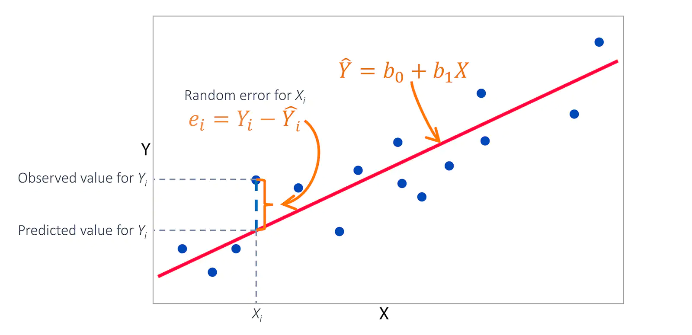

```{r setup, include=FALSE}
knitr::opts_chunk$set(echo = F, message=F, warning=F)
###library('WDI')
###
library("knitr")
library("ggplot2")
library("tidyverse")
library("ggpubr")
library("rstatix")
library ("lm.beta")
library ("pROC")
require("DescTools")
library("car")
library("caret")
library("lmtest")

load ("marketing.rda")
library("AER")
data("CPS1988")
```

## Linear regression models

Statistical models allow errors (uncertainty):

$$Y = f(X_1, X_2, \ldots, X_p) + ε$$

where $f(X_1, X_2, \ldots, X_p)$ is a **deterministic** part and $\varepsilon$ is an (random) **error**

When the model is **linear in its parameters** the above equation can be written as:

\begin{align}
Y &= f(X_1, X_2, \ldots , X_p) + ε \\
  &= β_0 + β_1X_1 + β_2X_2 + \cdot + β_pX_p + ε
\end{align}

The model is **estimated** (ie unknown parameters are estimated) based (as usual)
on **sample** of the size $n$:

\begin{align}
y_1 x_{11} x_{12} ... x_{1p}\\
y_2 x_{21} x_{22} ... x_{2p}\\
...\\
y_n x_{n1} x_{n2} ... x_{np}\\
\end{align}

There are $n$ cases or observations ($i=1,\ldots n$);

There are $p$ explanatory variables (predictors) ($j=1,\ldots, p$);

$x_{ij}$ is the value of the explanatory variable $X_j$ of the $i$th case:

$$y_i = β_0 + β_1 x_{i1} + . . . + β_p x_{ip} + ε_i$$

where:

$ε_i$’s (greek letter epsilon; errors, or noise) are i.i.d. $N(0, σ^2)$ (iid means **independent and identically distributed**)

$β_0$ = intercept;

$β_j$ = regression **coefficient** or **slope** for the $j$-th explanatory
variable, $j = 1, \ldots, p$

$σ^2 = \mathrm{var}(ε_i)$ = the variance of errors (assumed **constant**)

Observed (known): $y_i, x_{i1}, x_{i2}, \ldots , x_{ip}$

Unknown: $β_0$, $β_1, \ldots, β_p$, $σ^2$, $ε_i$’s

Random: $ε_i$’s, $y_i$’s

Constants (not random): $β_j$’s, $σ^2$, $x_{ij}$’s

## Linear regression model assumptions

A1. **Linearity of the Data**
The regression model is linear in the paramaters (may not be linear
in the variables)

**Example**: Cobb-Douglas production function

$$V = \alpha K^{\beta_1} L^{\beta_2}$$

where: $V$ -- output; $K$ -- capital; $L$ -- labour

$$\mathrm{log}(V) = \mathrm{log}(\alpha) + \beta_1 \mathrm{log}(K) + \beta_2 \mathrm{log}(L)$$

is **linear in parameters**


A2. The **regressors are fixed**  (assumed to be) or
   $X$ is fixed (non random) or $X$ is random but uncorrelated with $\varepsilon$

A3. Expected/mean value of $\varepsilon$ is $0$: $E(\varepsilon|X) =0$

A4. The variance of each $\varepsilon_i$ is constant $\mathrm{var} (\varepsilon_i|X) = \sigma^2$
(So called **Homoscedasticity** Assumption)
Can be visually assesed with scatterplot (theoretical values vs residuals)

A5. There is no correlation between error terms (no **autocorrelation**)
  $\mathrm{Cov} (\varepsilon_i, \varepsilon_j |X) = 0$ for $i \not= j$

A6. There is no multicollinearity among ($X$'s)

A7. **Normality**: For any fixed value of $X$, $Y$ is normally distributed.


If assumptions A1--A7 hold it can be shown that the method of **Ordinary
Least Squares** (**OLS**) provides estimators of regression function with
several desirable properties:

1. The estimators are linear (functions of dependent variable)

2. The estimators are unbiased

3. In the class of unbiased linear estimators, OLS estimators have 
**minimum variance** (efficiency)

Interpretation:
$β_j$ the regression coefficient for $X_j$, is the **mean change** in the
response $Y$ when $X_j$
is increased by one unit holding other $X_i$’s constant.

## R fun

```{r, echo=F}
s <- 10
beta1 <- 1.2
size <- 10 ## sample size
x <- seq (1:size)
epsilon <- rnorm(size, 0, s)
lsize <- 0.4

y.true <- 5 + beta1 * x ## true equation
## sample equations
y <- y.true + epsilon
ss <- 's1'

xy.true <- data.frame(x, y.true, ss)
xy <- data.frame(x, y, ss)
b1 <- c()

for (i in 1:29) {
  epsilon <- rnorm(size, 0, s)
  y <- y.true + epsilon
  ss <- sprintf("s%i", i)
  xy.xy <- data.frame(x, y, ss)
  xy <- xy |> bind_rows(xy.xy)
  ## remember b1
  m1 <- lm(y ~ x,  data=xy.xy)
  b1[i] <- coef(m1)[2]
}
##nrow(xy)

p1 <- ggplot(xy, aes(x=x, y=y, color=ss, group=ss)) +
  geom_point() +
  ## no legend
  guides(colour=FALSE) +
  geom_smooth(method='lm', se=F, size=lsize) +
  geom_smooth(data=xy.true, aes(x=x, y=y.true), 
              method='lm', se=F, size=1, color='black')
p1
```

* Black line: true equation y = 5 + 1.2 x + e where e ~ N(0, 10)

* Color lines/color dots: estimated equation from a (random) sample of size N=10

* number of repetitions 30

* histogram of 30s b1 coefficients:

```{r}
b1 <- as.data.frame(b1)
ggplot(b1, aes(x=b1)) + geom_histogram(binwidth = .6, fill=default_cyan)
mean.b1 <- mean(b1$b1)
summary(b1$b1)
```

mean of b1 is `r mean.b1`

## Estimating the model parameters

### Simple Linear Regression

$$\sum_{i=1}^n (y_i − \hat y_i)^2 = \sum_{i=1}^n (y_i − \hat β_0 − \hat β_1 x_i)^2$$

{width=70%}

$y = β_0 + β_1 x$ is the least square line for the population
(which is fixed but unknown; and **we are interested in**)

$y = \hat β_0 + \hat β_1 x$ is the least square line for a sample
(which is random but can be calculated; however **we are *not* interested in**)

note: $β_j$’s are the coefficients of the model,
and $\hat β_j$’s are the **estimates** of $β_j$’s

$$L(\hat\beta_0, \hat\beta_1) = \sum_{i=1}^n  (y_i - \hat \beta_0 - \hat \beta_1 x_i)^2 \to \min$$

$$\frac{\partial L}{\partial \hat \beta_0} =  -2 \sum_{i=1}^n (y_i - \hat\beta_0 - \hat \beta_1 x_i) = 0$$

$$\frac{\partial L}{\partial \hat \beta_1} =  -2 \sum_{i=1}^n x_i (y_i - \hat\beta_0 - \hat \beta_1 x_i) = 0$$

we obtain finally:

$$\hat \beta_1 = \frac{\sum_{i=1}^n (x_i - \bar x)(y_i - \bar y)}{\sum_{i=1}^n (x_i - \bar x )^2}$$

$$\hat \beta_0 = \bar y - \hat\beta_1 \bar x$$


### Example:

Data on advertising budgets for youtube, facebook and newspapers (thousand USD) + sales (thousand units). 

```
#data("marketing", package = "datarium")
library('datarium')
model1 <- lm(sales ~ youtube, data = marketing)
summary(model1)
# components of lm model (formally R `object`):
names(model1)
```

### Multiple Linear Regression

$$\sum_{i=1}^n (y_i − \hat y_i)^2 = \sum_{i=1}^n (y_i − \hat β_0 − \hat β_1 x_{i1} - ... - \hat \beta x_{ip})^2 \to \min $$

note: $β_j$’s are the coefficients of the model,
and $\hat β_j$’s are the **estimates** of $β_j$’s

The estimation *idea* is similar to SLR but formulas are more complex of course [omitted]

```
model2 <- lm(sales ~ youtube + facebook + newspaper, data=marketing)
summary(model2)
```

### Fitted values

The **fitted** value or predicted value:

$$\hat y_i = \hat β_0 + \hat β_1 x_{i1} + \ldots + \hat β_p x_{ip}$$

$\hat y_i$ is the fitted value while $y_i$ is the observed value

An **errors** (**unknown**) are

$$ε_i = y_i − β_0 − β_1 x_{i1} − \ldots − β_p x_{ip}$$

The errors $ε_i$ can be estimated by the **residuals** $e_i$ defined as:

$$e_i = y_i − \hat y_i$$

The residuals $e_i$ hence have the properties

$$\sum_{i=1}^n e_i = 0 $$

and

$$\sum_{i=1}^n x_{ij} e_i = 0, j=1,2,\ldots,p $$

The variance $σ^2$ of the errors $ε_i$’s is estimated by the **mean square
error** (MSE) = the sum of squares of residuals divided by $n − p − 1$.

$$\mathrm{MSE} = \frac{\sum_{i=1}^n e_i^2}{n-p-1} =
 \frac{\sum_{i=1}^n (y_i - \hat y_i)^2}{n-p-1}$$

It can be shown that MSE is an unbiased estimator for $σ^2$.


## Predictions for SLR

There are two kinds of predictions for the response $Y$ given
$X = x_0$ based on a SLR model $Y = β_0 + β_1X + ε$:

$$E[Y|X = x_0] = β_0 + β_1 x_0$$

(given $X = x_0$, estimation of the mean response)

or

$$Y = β_0 + β_1 x_0 + ε$$

(given $X = x_0$, prediction of the response for one specific observation)

For estimating $E[Y|X = x_0] = β_0 + β_1 x_0$, the variance for the
estimate $\hat β_0 + \hat β_1 x_0$ can be shown to be

$$\mathrm{var} (\hat β_0 + \hat β_1 x_0) = \sigma^2 ( \frac{1}{n} + \frac{(x_0 - \bar x)^2}{
 \sum_{i=1}^n (x_i - \bar x)^2 }   )$$

To predict $Y = β_0 + β_1 x_0 + ε$, we need
to include the extra variability from the noise $ε$.

\begin{align}
\mathrm{Var} (\hat β_0 + \hat β_1 x_0 + \varepsilon) &= \mathrm{Var} (\hat β_0 + \hat β_1 x_0) +
\mathrm{Var}(\varepsilon)\\
&=\sigma^2 ( \frac{1}{n} + \frac{(x_0 - \bar x)^2}{
 \sum_{i=1}^n (x_i - \bar x)^2 }   ) + \sigma^2
\end{align}

As $n$ gets large, $\mathrm{Var}(\hat β_0 + \hat β_1 x_0)$ would go down to $0$, but
$\mathrm{Var}(\hat β_0 + \hat β_1 x_0 + \varepsilon)$ goes down to $\sigma^2$.

An accurate prediction (less variance) comes from

* small $σ^2$ (i.e., small noise $ε$’s)

* large sample size $n$

* large $\sum^n_{i=1} (x_i − \bar x)^2$ (more spread in predictors = more information)

* small $(x_0 − \bar x)$ (The regression line passes through
  the point  ($\bar x, \bar y$; so there is no error here)

The $100(1 − α)$% confidence interval for $β_0 + β_1 x_0$ is

$$\hat β_0 + \hat β_1 x_0 \pm t_{(n-2,\alpha)} \hat \sigma \sqrt{ \frac{1}{n} + \frac{(x_0 - \bar x)^2}{
 \sum_{i=1}^n (x_i - \bar x)^2 }}$$

The $100(1 − α)$% prediction interval for $β_0 + β_1 x_0 + \varepsilon$ is

$$\hat β_0 + \hat β_1 x_0 \pm t_{(n-2,\alpha)} \hat \sigma \sqrt{ 1 + \frac{1}{n} + \frac{(x_0 - \bar x)^2}{
 \sum_{i=1}^n (x_i - \bar x)^2 } }$$

where $\hat \sigma = \sqrt{\mathrm{MSE}}$

```
## show the structure of marketing database
str(marketing)

# copy the structure of marketing to empty df
marketing.fut <- marketing |> filter(FALSE)
## add one new row
marketing.fut <- marketing.fut |> add_row(youtube = 100, 
    facebook = 300, newspaper = 40, sales = NA)
## Make predictions
## narrower
predict(model1, newdata = marketing.fut, interval = 'confidence' )
## wider
predict(model1, newdata = marketing.fut, interval = 'prediction' )
```

## Model Verification

Recall: **MSE** or **Error Variance** is

$$\mathrm{MSE} =  \hat \sigma^2 = \frac{\sum e_i }{n - p -1}$$

Square root of $\hat \sigma^2$ is called  **standard error** (of the regression)

The **standard error of the regression** is the average distance that the observed values
fall from the regression line. Often used as a summary measure of the **fit** (regression line to data)

### Interference about slope parameters

Providing standard assumptions A1--7 hold, then $\hat \beta_1$ is
an unbiased estimator for $\beta_1$ and has a population variance:

$$\sigma_{\beta_1}^2 = \frac{\sigma^2}{\sum_{i=1}^n (x_i - \bar x )^2}$$

and an unbiased sample variance estimator

$$\hat \sigma _{\beta_1}^2 = \frac{\hat\sigma^2}{\sum_{i=1}^n (x_i - \bar x )^2}$$

Thus, the variance of the slope coefficient, $\beta_1$, depends on:

* The distance of sample points from regression line ($\hat\sigma^2$)

* Total deviation of the X from the mean ($\sum_{i=1}^n(x_i - \bar x)^2$)

$\hat \beta_1$ has greater variability when $X$ has less variability;
and $\hat \beta_1$ has less variability when $X$ has greater variability

### R fun

```{r}
p2 <- xy |> filter (x > 3.5 & x < 6) |>
ggplot(aes(x=x, y=y, color=ss, group=ss)) +
  geom_point() +
  ## no legend
  ggtitle('Less variability of X') +
  guides(colour=FALSE) +
  geom_smooth(method='lm', se=F, size=lsize, fullrange = TRUE) +
  geom_smooth(data=xy.true, aes(x=x, y=y.true), 
              method='lm', se=F, size=1, color='black')
p2
p3 <- p1 + ggtitle('Greater variability of X')
p3
```


As $\hat \beta_1$ (estimator of $\beta_1$) is normally distributed it can be shown that:

$$t = \frac{(\hat \beta_i - \beta_i)}{\hat \sigma_{\beta_1}}$$

for SLR or (for MLR):

$$t = \frac{(\hat \beta_i - \beta_i)}{\hat \sigma_{\beta_i}}$$

is $t$-distributed with $n - p - 1$ degrees of freedom.

### Significance of slope parameters $\beta_i$

$H_0: \beta_i = 0$

$H_1: \beta_i \not= 0$

$$\hat t = \frac{\hat \beta_i}{ \hat \sigma_{\beta_i}}$$

It is a standard practice (for computer programs ) to provide probability
$|t| \geq \hat t$. If the probability is small one can reject $H_0$


### Analysis of variance

Recall: residual  $e_i = y_i - \hat y_i$, or $y_i = \hat y_i + e_i$

Substracting $\bar y$, squaring and adding up we get:

$$\sum_i (y_i - \bar y)^2 = \sum_i (\hat y_i - \bar y)^2 + \sum_i e^2$$

which we denote as

$${\rm TSS} = {\rm ESS} + {\rm RSS}$$

TSS = total sum of squares; 

ESS = **explained** sum of squares (called also **regression sum of squares** SSR);

RSS = **residual** sum of squares (called also **error sum of squares** SSE)

Dividing by TSS we obtain:

$$1 = {\rm ESS}/{\rm TSS} + {\rm RSS}/{\rm TSS}$$

$R^2 = ESS/TSS$ is called **coefficient of determination**

For SLR, $R^2 = r_{xy}^2$ is the square if the correlation between $X$ and $Y$.
So multiple $R^2$ can be regarded as **generalization** of correlation coefficient.

Each $X_i$ increases $R^2$. To accomodate for that **adjusted** $R^2$ is proposed, defined as:

$$\bar R^2 =  1 - (1  - R^2) \frac{n - 1}{ n - p -1}$$ 

### Analysis of variance cd

Model 1 is **nested in** Model 2 if Model 1 is a **special case** (or **reduced model**)
of Model 2 (or Model 2 is an **extension** of Model 1 or **full model**)

Examples:

A: $Y=\beta_0 + \beta_1 X_1 + \beta_2 X_2 +\beta_3 X_3$

B: $Y=\beta_0 + \beta_1 X_1 + \beta_2 X_2$

C: $Y=\beta_0 + \beta_1 X_1 + \beta_3 X_3$

D: $Y=\beta_0 + \beta_1 X_1$

B is nested in A but C is not nested in B

Note: all nested models have the same TSS. RSS of reduced model is
**equal or greater** than a full model. ESS of reduced model
is **equal or smaller** than a full model.

$$RSS_{\mathrm{reduced}} \geq RSS_{\mathrm{full}}$$

Which to choose? We choose full model if the difference is **large enough**
(ie. significant). It can be shown that:

$$F = \frac{(RSS_{\mathrm{reduced}} - RSS_{\mathrm{full}}) / (df_{RSS,reduced} -
  df_{RSS,full} )}{MSE_{\mathrm{full}} }$$

$df_{RSS,.}$ is df for RSS; The smaller F, the more the reduced model
is favored

Under $H_0$, the F-statistic has an F-distribution with
$df_{RSS,reduced} -  df_{RSS,full}$ and $df_{RSS, full}$ degrees of freedom.

We can test the hypothesis that all slope coefficients are $0$
which is equivalent to evaluate the **overall significance** of a (full) model:

$$y_i = \beta_0 + \beta_1 x_{i1} + \beta_p x_{ip} + \varepsilon_i$$

versus (reduced) model:

$$y_i = \beta_0 +\varepsilon_i$$

note that it means $\hat \beta_0 = \bar y$  (all \hat y are equal and $\sum \bar y = \sum y$); thus

$$RSS_{\mathrm{reduced}} =
\sum_{i=1}^n (y_i - \hat \beta_0)^2 = \sum_{i=1}^n(y_i - \bar y)^2 = TSS_{\mathrm{full}}$$

error in reduced = total variance (BTW $TSS_{\mathrm{reduced}} = TSS_{\mathrm{full}}$)

\begin{align}
F &= \frac{(RSS_{\mathrm{reduced}} - RSS_{\mathrm{full}}) / (df_{RSS,reduced} -
  df_{RSS,full} )}{MSE_{\mathrm{full}} } \\
  &= (\mathrm{ESS}/p ) / ( \mathrm{RSS}/( n - p - 1))
\end{align}

Moreover, $F \sim F_{p, n - p - 1}$ (under $H_0$)

If the probablity $F > \hat F$ is small one can reject $H_0$.

```{r}
library('datarium')
model1 <- lm(sales ~ youtube, data = marketing)
model2 <- lm(sales ~ youtube + facebook + newspaper, data=marketing)
##
summary(model1)
```

Example: compute  TSS/RSS/ESS

```
## sse/rss (residual)
sse <- sum((fitted(model1) - marketing$sales)^2)
#find ssr/ess
ssr <- sum((fitted(model1) - mean(marketing$sales))^2)
#find sst/tss
sst <- ssr + sse
```

```{r}
## sse/rss (residual)
sse <- sum((fitted(model1) - marketing$sales)^2)
#find ssr/ess
ssr <- sum((fitted(model1) - mean(marketing$sales))^2)
#find sst/tss
sst <- ssr + sse
sse
ssr
sst
```

##  Verification cd

### Heteroscedasticity of error term

Higher sales = higher variablity?

```{r}
##
ggplot(marketing, aes(x=predict(model1), y= sales)) +
  geom_point() +
  geom_abline(intercept=0, slope=1)
```

$\hat\beta_i$ estimators  are no longer **efficent** ie. they
have higher variance than they would have if the assumption
of homoskedasticity was met.

In consequence: standard errors are **underestimated**
F- and t-statistics, $p$-values are inflated, leading to an increased
likelihood of false positives (type I errors).

Heteroscedasticity can be tested with Breusch-Pagan (BP) and White tests

The idea of BP test:

* estimate LS regression, compute residuals $e_i^2$

* regress $e_i^2$ on $p$ regressors of the model:

$$e^2 = \gamma_0 + \gamma_1 x_1 + \cdots + \gamma_p x_p + \nu$$

*  $H_0: \gamma_1 = \gamma_2 = \ldots = \gamma_p = 0 $ (homoscedasticity)

*  $H_1:$ at least one of $\gamma_1... \gamma_p$ are not equal zero  (so $e^2 != \mathrm{const}$)

https://real-statistics.com/multiple-regression/heteroskedasticity/breusch-pagan-test/

The main package for specification testing of linear regressions
in R is the `lmtest` package.

Testing for heteroskedasticity in R can be done with the `bptest` function

By default (using a regression object as an argument) `bptest` performs the 
(generalized) Breusch-Pagan test:

```
library("lmtest")
bptest(model1)
```

Small $p$ indicates that at least one of $\gamma_1... \gamma_p$ is significantly
different form zero i.e. there is a heteroskedasticity of error term.

### White test of heteroskedasticity of an error term

This test is similar to the Breusch-Pagan Test, except that in the second OLS regression,
the right side is composed of $x1, …, x_p$ as well as
(squares) $x_1^2, …, x_k^2$, and interactions $x_1 x_j$ for all $i ≠ j$ (this is called **interactions**). 

```
##white test
## one variable = no interactions
bptest(model1, ~ youtube + I(youtube^2), data=marketing)

bptest(model2, ~ youtube + facebook + newspaper +
 I(youtube^2) + I(facebook^2) + I(newspaper^2) +
 youtube * facebook + youtube * newspaper + facebook * newspaper, data=marketing)
```

### Functional form

Is linear form appriopriate?

Ramsey RESET test general idea:

$$y = \beta_0 + \beta_1 x_1 + ... +\beta_p x_p + \delta_1 \hat y^2 + \epsilon$$

why add $y^2$, because $y^2 = (\hat \beta_0 + \hat \beta_1 x_1 +... \hat\beta_p x_p)^2$
so in result we have a quadratic function

there is a variant of RESET test with $y^3$ ie:

$$y = \beta_0 + \beta_1 x_1 + ... +\beta_p x_p + \delta_1 \hat y^2 + \delta_2 \hat y^2 + \epsilon$$

$H_0: \delta_1 = 0$ or $H_0: \delta_1 = \delta_2 = 0$ (additional variables are insignificant)


```
resettest(model1)
```

Low $p$ indicates functional form misspecification.

```{r}
resettest(model1)
```

### Autocorrelation

Recall (A5.) **There is no correlation between error terms 
  $\mathrm{Cov} (\varepsilon_i, \varepsilon_j |X) = 0$ for $i \not= j$**

Correlated errors can arise when observations have a spatial
or [usually] **temporal order**

Consequences of correlated errors: $\hat \beta$ estimators no longer have
minimal variance (CI and significance tests are no longer accurate)

When the observations have a natural sequential order, the
correlation is referred to as **autocorrelation**

### Testing for Autocorrelation

A time plot or an index plot of the residuals is a plot of residuals
vs the (time) order they are recorded. Points in a time-plot are
connected by a line.

A **smooth time-plot** is a sign of positive autocorrelation, since
a smooth time plot means successive residuals are close together


```
### Average monthly expenditures vs total consumption (per capita)
### https://bdl.stat.gov.pl/bdl/metadane/cechy/1870

library('eurostat')
library('bdl') ## local-data-bank or Bank Danych Lokalnych
options(bdl.api_private_key ='...')

p.vars <- c('7737',  ## Average monthly expenditures
            '216968' ## ditto income
)
d <- get_data_by_variable(p.vars, 
    unitParentId=NULL, ## unitLevel4 id
    ## 0 -PL; 1 - macroregion
    unitLevel=0) |>
  select (year, expenditures=val_7737, income=val_216968) |>
  na.omit()

model10 <- lm(expenditures ~ income, data=d)
summary(model10)

## Plot
ggplot(d, aes(y=predict(model10) - expenditures,
   x= as.numeric(year))) +
  geom_line()
```

```{r}
### Average monthly expenditures vs total consumption (per capita)
### https://bdl.stat.gov.pl/bdl/metadane/cechy/1870

library('eurostat')
library('bdl') ## local-data-bank or Bank Danych Lokalnych
options(bdl.api_private_key ='19c1cfc8-faec-4db5-9e9a-08db64593a4a')

p.vars <- c('7737',  ## Average monthly expenditures
            '216968' ## ditto income
)
d <- get_data_by_variable(p.vars, 
    unitParentId=NULL, ## unitLevel4 id
    ## 0 -PL; 1 - macroregion
    unitLevel=0) |>
  select (year, expenditures=val_7737, income=val_216968) |>
  na.omit()

model10 <- lm(expenditures ~ income, data=d)
summary(model10)

## Plot
ggplot(d, aes(y=predict(model10) - expenditures,
   x= as.numeric(year))) +
  geom_line()
```

Error term is autocorrelated.

The equation: $\mathrm{expenditures} = \beta_0 + \beta_1 \mathrm{income}$ is a *linear consumption
function*. Marginal propensity to consume (MPC) is the slope parameter $\beta_1$.

### Testing for autocorrelation: Durbin-Watson test

In Time Series analysis, the so called **first-order
autoregressive model**, abbreviated AR(1) can be formally specified as:

$$ε_t = ρ ε_{t−1} + ω_t , |ρ| < 1$$

and $ω_t$ is not autocorrelated

Note: we change index to $t$ to emphasise assumed temporal order

The actual autocorrelation structure may be more complex
(e.g. AR(2) , AR(3) , etc.) In this case, the first-order structure is
a simple approximation.

The test of the null hypothesis of no autocorrelation, $H_0: \rho = 0$
is based on the Durbin-Watson statistic

$$d = \frac{\sum_{t=2}^n (e_t - e_{t-1})^2}{ \sum_{t=1}^n e^2_t}$$

where the $e_t$ are the residuals when the regression equation is estimated by
least squares. When the alternative hypothesis is of positive autocorrelation in
errors—that is, $H_1: \rho > 0$

Under $H_0$, of no autocorrelation, $d$ should be close to 2.

We use two cut-off values, $d_L$ and $d_U$ (upper/lower), which depend on the
number of parameters $p$, the sample size $n$, and the desired
significance level $α$ of the test.

• $d < d_L$ , reject $H_0$

• $d > d_U$, do not reject $H_0$

• $d_L < d < d_U$, the test is inconclusive

To test for negative autocorrelation, use the test statistic
($d^* = 4 − d$) then follow the test for positive autocorrelation:

• $d^* < d_L$ , reject $H_0$

• $d^* > d_U$, do not reject $H_0$

• $d_L < d^* < d_U$, the test is inconclusive

The above procedure can be called **classical** I mentioned it as it is described in many textbooks
BUT using R we do not have to use it.


```
dwtest(model1)
##  or
#library("car")
#durbinWatsonTest(model1)
```

If $p$-value is less than 0.05 (both in `dwtest` and `durbinWatsonTest`),
we can reject the null hypothesis
and conclude that the residuals in the regression model are autocorrelated.

```{r}
lmtest::dwtest(model10)
```

### Testing for autocorrelation: Breusch-Godfrey test

$H_0$: There is no autocorrelation at any order less than or equal to $p$.


```
bgtest(model1)
```

If $p$-value is less than 0.05, we can reject the null hypothesis and conclude
that the residuals in the regression model are autocorrelated.


### Multicollinearity

VIFs exceeding 4 warrant further investigation,
while VIFs exceeding 10 are signs of serious multicollinearity
requiring correction.

```
## Not appropriate for model with 1 regressor
vif(model2)
## or hight correlation coefficients
```

```{r}
vif(model2)
## or correlation matrix
marketing0 <- marketing |> select ( - sales )
cor(marketing0, method = "pearson")
```

Anyway VIFs exceeding 4 are suspicious 
while VIFs exceeding 10 
are signs of serious multicollinearity requiring correction

### Normality

```
shapiro.test(resid(model1))
```

```{r}
shapiro.test(resid(model1))
```


## Categorical variables

In a linear regression model

$Y = β 0 + β_1 X_1 + . . . + β_p X_p + ε$

one can include **categorical** (ie non-numeric) variables as predictors.

One has to use the following trick: **recode** categorical variable with
$l$ levels (ie. $l$ values) into $l$ **binary variables**:

$L1,\ldots,L_l$ levels of original categorical variable

$l1, \ldots, l_l$ binary variables recoded along the formula: $l_k = 1$ if $L=L_k$, zero otherwise

note: $l_1 + \cdots + l_k = 1$ (for every observation the sum of all $l$ variables is one; why?)

as $l$ variables are numbers (well two numbers, 0, 1) we can include them into LR
equation (say $X_p$ is categorical with $l$-levels):

\begin{align}
Y &= β_0 + β_1 X_1 + . . . + β_p X_p + ε\\
  &= β_0 + β_1 X_1 + . . . +  (\delta_1 l1 + ... + \delta_l l_l) + ε \\
  &= β_0 - c + β_1 X_1 + . . . +  (\delta_1 + c) l1 + ... + (\delta_l + c) l_l) + ε \\
  &= β_0 + β_1 X_1 + . . . +  c(l1 + ... + l_l) + ε 
\end{align}

where $c$ is **any** number. So for any value of $c$, the coefficients
$(β_0 −c, β_1,\ldots, δ_1 +c, δ_2 +c, δ_3 + c)$ solves the equation (there are $\infty$ number of solutions)

so?

So, one **can not** include $l_1, \ldots, l_l$ variables in the model,
but only $l_1, \ldots, l_{l-1}$
(strictly speaking all but one $l$ variable, regardless which one)

**Now LR equation has exactly one solution**

Let's consider the following example

```
library('AER')
d <- CPS1988
```
Current Population Survey data from March 1988.
Cross-sectional data on males 18--70 with positive annual income greater
than 50 USD in 1992. You can obtain more details by `? CPS1988` (or F1 in RStudio)

wage = wage USD/week

education = education (years)

experience = experience (years)

ethnicity = ethnicity (cauc/afm)

smsa = residence in standard metropolitan statistical area

region = US region

parttime = works part-time (or not)

```
levels(ethnicity)
levels(parttime)
## if you got NA try
levels(as.factor(ethnicity))

nrow(d)
```

The model

```
model3w <- lm ( log(wage) ~ experience + I(experience^2) + education + ethnicity,
               data = d )
```

NOTE: Inside formula `+`,`*`, `/`,and `^` has special meaning
If one has to specify `x^2` one has to use `I()` function as in the example above

```{r}
model3w <- lm ( log(wage) ~ experience + I(experience^2) + education + ethnicity,
               data = CPS1988 )
summary(model3w)
```
Note: `ethnicity` was recoded automaticaly by R.

In R factors are handled as (set) of dychotomous variables
automatically If factor contains more than 2 levels, $l-1$ dychotomous
variables will be created

`Ethnicityafam` means `afam` is `1` and `cauc` 
is `0` so negative coefficient
can be interpreted as difference between (`log`) wage between afam (1)
and cauc(0)

So on the average `Afam` earns approx 0,24 USD less than `Cauc`


BTW Setting reference groups for factors:
 he first level of the factor is treated as the omitted reference group.
 Use the `relevel()` function to change.

```
d1 <- d |> mutate (ethnicity = relevel(ethnicity, ref='afam'))
```

## Categorical variables with more than two levels

Nine-month academic salary of academic staff in US (library `car`)
For more information (`? Salaries`)

```
library("car")
head(Salaries, n=9)
model9 <- lm(salary ~ yrs.service + rank + discipline + sex, data=Salaries)
summary(model.9)
```

### Interactions

```
model3b <- lm ( log(wage) ~ experience + I(experience^2) + education*ethnicity,
                data = CPS1988 )
summary(model3b)
anova(model3b, model3w)
```

Interaction  `education*ethnicity` is significant at any reasonable level

## Prediction revisited

Often recommended procedure:

divide sample into **training** and **test** sets (subsamples); for cross-sectional data
the division should be random; for time-series, the most up-to-date data should
contain test sample

estimate paramaters with training subsample

verify the model with test subsample

### Example (marketing data again)

```
## 80% for train; the rest for test
sample_size <- floor(0.80 * nrow(marketing))

## seq(n) = 1,2,3,4...,n
## sample(v, c) = generate c sample from v vector
train_ind <- sample(seq(nrow(marketing)), size = sample_size)

## fetch training data
train.data <- marketing[train_ind, ]
## fetch but not training data
test.data <- marketing[ -train_ind, ]

predictions1 <- predict(model1, test.data )

predictions1

## basic plotting functions
plot(sales ~ youtube, data = train.data )
 points (predictions1 ~ test.data$youtube, col='blue')
 lines (predictions1 ~ test.data$youtube, col='red')
```

The root mean square error (RMSE) measures the average difference
between a statistical model’s predicted values and the actual
values. Mathematically, it is the standard deviation of the
residuals. Residuals represent the distance between the regression
line and the data points.

```
rmse <- sqrt(mean(model1$residuals^2))
```

So we can test `model1` and `model2` with the same `train.data`
and `test.data` samples. Then use RMSE to decide which model performs
better with new (unseen) data...

## Model comparison

If RSS of a  full model significantly smaller than nested one?

```
model0 <- lm(sales ~ 1, data=marketing)
anova(model2, model1)
## or
anova(model2)
anova(model1)
anova(model0)
```

```{r}
model0 <- lm(sales ~ 1, data=marketing)
anova(model2, model1)
anova(model2)
anova(model1)
anova(model0)
```

### Stepwise regression


## Functional forms

### Log-linear

$$Y = \beta_1 X_2^{\beta_2} X_3^{\beta_3}\ldots$$

Cobb-Douglas production function is an example of log-linear model

$$Q = \beta_1 L^{\beta_2} K^{\beta_3}$$

where: 

$Q$ -- output; 

$L$ -- *labour input*;

$K$ -- *capital*

This model is nonlinear in paramaters, however 
taking logarithms on both sides, we get:

$$\ln Q = \ln \beta_1 + \beta_2 \ln L + \beta_3 \ln K$$

This is known as log-log, double-log or constant elasticity model.

In log-log model slope coefficients can be interpreted as **elasticities**

Elasticity is the % change in one variable divided
by % change in the second variable, or
percentage change in $x$ results in a $\beta$ % change in $y$

If there are more than one $x$ variables, $\beta_i$ is a **partial
elasticity** of $y$ (output, $Q$) with respect to $\beta_i$
(labour, $\beta_2$), holding all other variables constant.

Percentage change of output ($Q$) for a percentage change in labour input,
ceteris paribus.

for CD sum of slope coefficients ($\beta_2 + \beta_3$) is
**returns to scale**. If $\beta_2 + \beta_3$ = 1, there are constant
returns to scale, if $\beta_2 + \beta_3$ = 1 there are decreasing
returns to scale.

### Example: Cobb-Douglas function for USA 2005 [Gujarati]

```
### CDdata.csv
us <- read.csv(file='CDdata.csv', sep=',',header=T) %>%
  select(output, labor, capital)
##
cor(as.matrix(us), method = 'pearson')

model2 <- lm( log(output) ~ log(labor) + log(capital), data = us)
summary(model2)
```

Increase of labour input by 1%, results in output increase by 0.47 holding
the capital constans.  Holding the labor constnt, increase capital by 1%
results in increase of output by 0.52 percent. The sum of two
slope coefficients is 0.99.


### Example: Engel curve

Engel curve describes how household expenditure
on a particular good or service varies with household income.

It suggests that as family income increases, the percentage spent on
food decreases, even though the total amount of food expenditure
increases. Expenditure on housing and clothing remains proportionally
the same, and that spent on education, health and recreation
rises. (Wikipedia)

Engel law: *the total expenditure that is devoted to food tends
to increase in arithmetic progression as total expenditure increases in
geometric progression*

Consumption is under-proportional with income. This
can be formally descibed by the power function with parameter $b_1$
which can be interpreted as an elasticity (of demand)


```
##  US household survey 1995 [Gujarati]
##  variables:
##  expend =  total expenditures
##  fdho = food expenditures
## 
f <- read.csv(file='SEDHOdata.csv', sep=',',header=T)  %>%
  filter (fdho > 0)

ggplot2::ggplot(f, aes(x=expend, y=fdho)) + 
    geom_smooth(se=F) +
  geom_point()

model3 <- lm(log(fdho) ~ log(expend), data = f)
summary(model3)
```

Percent increse in expenditures results in 0.48% percent increae
in food expenditures. 

### Example: Engel curve (for Poland)

```
library('eurostat')
library('bdl') ## local-data-bank or Bank Danych Lokalnych
options(bdl.api_private_key ='19c1cfc8-faec-4db5-9e9a-08db64593a4a')
p.vars <- c('7737',  ## Average monthly expenditures
            '7739'   ## food and NA beverages
)
## province-level (sample size = 17)
d <- get_data_by_variable(p.vars, 
                          unitParentId=NULL, ## unitLevel4 id
                          ## 0 -PL; 1 - macroregion
                          unitLevel=3) |>
  select (year, name, expenditures=val_7737, food=val_7739) |>
  na.omit() |>
  mutate(year = as.numeric(year)) |>
  group_by(name) |> arrange(year) |>
  filter (row_number()==n())

model11 <- lm(log(food) ~ log(expenditures) , data=d)
summary(model11)

```

### Example: Worldwide meat consumption

$$M = b_0 {\rm GDP}^{b_1}$$

```
##meat_and_gni.csv ### FAO database 2020
meat <- read.csv(file='meat_and_gni.csv', sep=',',header=T)  

ggplot2::ggplot(meat, aes(x=GNI, y=Meat)) + 
    geom_smooth(se=F) +
  geom_point()

model3 <- lm(log(Meat) ~ log(GNI), data = meat)
summary(model3)

```

### Expontential model

If

$$Y = a_1 a_2^{x_2} a_3^{x_3}\ldots$$

then

$$\ln Y = \ln a_1 + \ln a_2 x_2 + \ln a_3 x_3  \ldots$$

### Linear trend


$$Y = a_1 + a_2 t + u$$
The slope coefficient $a_2$ gives **absolute** (not relative or percentage)
change in $Y$ per unit time period (annually for example)

Since we are dealing with time series, checking for autocorrelation is a must.

```
##GDP_US.csv`
```

### Log-lin or growth model

$$Y = a_1 a_2^t$$

or

$$\ln Y = \ln a_1 + \ln a_2 t + u$$
(GDP) rate of growth:

$$Y = a_0 (1+r)^t$$
where $r$ is rate of growth, and $t$ is number of time period ($1...T$)

$$\ln Y = \ln a_0 + t \ln (1 + r) $$

or

$$\ln Y = b_0 + b_1 t $$

where

$$ b_1 = \frac{\textrm{relative chance in } y}{\textrm{absolute change in } x}$$

is called **semi-elasticity** (usually multiplied by 100%). 
Interpretation (If $t$ denotes yearly data): average yearly change of $y$ (in %%)


```
##GDP_US.csv
```

BTW An R-square comparison is meaningful only if the dependent variable is
the same for both models. So the R-square from the linear model cannot
be compared with the R-square from the log-log model.

For the log-log model, the way to proceed is to obtain the antilog
predicted values and compute the R-square between the antilog of the
observed and predicted values. This R-square can then be compared with
the R-square obtained from OLS estimation of the linear model

### Lin-log model

$$Y_i = b_1 + b_2 \ln X$$

where

$$b_2 = \frac{\textrm{absolute change in } Y}{\textrm{change in } \ln X } = 
  \frac{\textrm{absolute change in } Y}{\textrm{relative change in } X}$$


Thus, if $\Delta X/X = 0.01$ (ie. 1%), the absolute change in $Y$ 
is $b_2 \cdot 0.01$. 

So if we estimate $b_2$ we have to divede by 100.
It is valid to say *if $X$ changes by 1% $Y$ changes by $b_2/100$*;
it is **invalid** to say *if $X$ changes by 1% $Y$ changes by $b_2$*

Engel law: *the total expenditure that is devoted to food tends
to increase in arithmetic progression as total expenditure increases in
geometric progression*

```
f <- read.csv(file='SEDHOdata.csv', sep=',',header=T) 

ggplot2::ggplot(f, aes(x=expend, y=sfdho)) + 
    geom_smooth(se=F) +
  geom_point()

model2 <- lm(sfdho ~ log(expend), data = f)
summary(model2)
```


### Reciprocal model

$$Y= b_1 + b_2 \frac{1}{X}$$


```
## reciprocal model
model1 <- lm(sfdho ~ I(1/expend), data = f)
summary(model1)
```

### Multinominal 

Second degree polynomial:

$$Y = a_1 + a_2 x + a_3 x^2$$


### KC and EKC

theory/hypothesis created by Simon Kuznets, according to which
as the country develops, social inequalities first increase,
and then they fall. Inverted U

The Environmental Kuznets Curve (EKC) postulates a similar relationship between
development and degradation of the natural environment.

https://www.sciencedirect.com/topics/earth-and-planetary-sciences/environmental-kuznets-curve

$CO$ production ($CO^2$ to be precise but it maybe misleading) and $GDP$:

$$CO = a_0 + a_1 PKB + a_2 PKB^2$$

meat consumption and income

$$M = a_0 + a_1 PKB + a_2 PKB^2$$

* To confirm  EKC $a_2 < 0$ (inverted U)

* $PKB_{\max} = a_1 / (-2 \cdot a_2)$

* $\max M = a_0 + a_1 * PKB_{\max} + a_2 * PKB_{\max}^2$

```
##meat_and_gni.csv

model5 <- lm(Meat ~ GNI + I(GNI^2), data = meat)
summary(model5)

```


## Panel data

**Panel** (data type) consists of both time series and cross section data

\begin{align}
y_{it} &= \beta_{0} + \beta_1 \mathbf{x}_{it1} +
 \beta_2 \mathbf{x}_{it2} + \cdots + \beta_K \mathbf{x}_{itK} + u_{it} \\
 u_{it} &= \alpha_i + \varepsilon_{it}\\
\end{align}

where: $i=1,\ldots,N$ nad $t=1,\ldots, T$. The $i$ subscript denotes cross-sectional dimension
(individuals, firms, states) whereas $t$ denotes the time-series dimension;
$\alpha_i$ denotes unobservable individual-specific effect and $\varepsilon_{it}$ denotes
the reminder disturbance;
$\alpha_i$ is **time-invariant** and accounts for any individual-specific
effect that is not included in the regression; $\varepsilon_{it}$ varies with individuals
and time and can be thought of as a usual disturbance in the regression.

* to consistently estimate $β$'s using OLS, one needs to
assume that $x$'s are not correlated with $u_{it}$.

* the resulting bias for omitting $\alpha_i$ is called
**heterogeneity bias**. It is a bias from omitting a time-constant variable(s).

* Panel data enables to control for **individual heterogeneity**.
(ie control for variables you cannot observe or measure.)

Panel data give more
informative data, more variability, less collinearity among variables, more degrees of
freedom and more efficiency

Are better for explaining dynamics of change...

#### Example: Drunk Driving Laws and Traffic Deaths (Stock, J.H. and Watson, M.W. (2007). *Introduction to Econometrics*,
2nd ed. Boston: Addison Wesley.)

Goal: analyze policies to reduce the number of drunk drivers

48 US. states, 7 years (1982,...,1988); number of traffic deaths (`fatal`);
Tax on beer in 1988 USD (`beertax`); state population (`pop`)

```{r, warning=F, message=F}
library('AER')
library('plm')
library('tidyverse')
data(Fatalities) ## press F1 to see documentation

f0 <- Fatalities |> select (fatal, beertax, pop, year, state) |>
  ## per 10 ths 
  mutate (fatal_rate = fatal/pop * 10000)

p1 <- f0 |> ggplot(mapping=aes(x=beertax, y=fatal_rate, color=state)) +
  geom_point(size=.4) +
  geom_smooth(method='lm', fill=NA) +
  geom_smooth(aes(x=beertax, y=fatal_rate), color='black', method='lm', fill=NA)

p1
```

**Does a tax on beer increase the number of traffic fatalities?**

* Many factors affecting traffic fatalities: roads quality,
  culture of drinking and driving, traffic etc

* Some of these factors are correlated with tax on beer
  and non-available or even non-measurable

* With panel data one can obtain consistent estimators if the
  unobserved factors that may be correlated with tax on beer, are
  time-invariant (**culture of drinking and driving** for example).


## Pooled OLS

Pooled OLS ignores panel structure and assumes no unobserved
individual-specific effects. If such effects exist and are correlated
with regressors, Pooled OLS will yield biased and inconsistent
estimates.

```{r}
## pdata.frame not data.frame
f1<- pdata.frame(f0, index = c("state", "year"))
m.pool <- plm(fatal_rate ~ beertax, data=f1, ##index=c("country", "year"),
model="pooling")
summary(m.pool)
```

Does a tax on beer increase the number of traffic fatalities?

## Fixed effects approach

In this case $\alpha_i$ are assumed to be fixed parameters to be estimated and the
reminder $\varepsilon_{it}$, independent and identically distributed
iid($0, \sigma^2_\varepsilon$)

The slope coefficients are constant but the intercept varies over individuals

$$y_{it} = \beta x_{it} + \alpha_i + \varepsilon_{it}$$

For each unit $i$, average this equation over all time periods $t$:

$$\bar y_{i} = \beta_{0} + \beta_1 \bar x_{i1} +
 \beta_2 \bar x_{i2} + \cdots + \beta_K \bar x_{iK} +
  \bar \alpha_{i} + \bar \varepsilon_{i}$$

Substract the **within-unit** average from each observation on that unit:

\begin{align}
y_{it} - \bar y_i &= \beta_1 (x_{it1} - \bar x_{i1}) +
\beta_2 (x_{it2} - \bar x_{i2}) + \cdots +
\beta_K (x_{itK} - \bar x_{iK}) +
 0 + \varepsilon_{it} - \bar \varepsilon_{i} \\
t&=1,...,T \\
\end{align}

or

\begin{align}
\ddot y_{it} &= \beta_1 \ddot x_{it1} + \beta_2 \ddot x_{it2} + \cdots +
\beta_K \ddot x_{itK} + \ddot\varepsilon_{it}
\end{align}

This is called **within estimator**

The LSDV estimator (Least Squares Dummy Variable estimator) is a
method for estimating fixed effects models in panel data by including
dummy variables to account for unobserved heterogeneity across
individuals (or entities).

\begin{align}
y_{it} =γ_1 D_{2i} + γ_2 D_{3i} +\cdots +γ_{N−1} D_{Ni} + β_1 x_{it1} + \cdots
β_K x_{itK} + u_{it}
\end{align}

where $D_{pi} = 1$ for $p=i$ or $0$ otherwise ($N-1$ dummy variables)

Numerically LSDV and within estimators are equivalent.

Note: removes constant terms and time-invariant variables from the estimation.
This means that one cannot estimate the effects of time-invariant variables
(like race, sex, innate ability) in a fixed effects model using
the within transformation, or LSDV. (Use RE)

```{r}
m.fe <- plm(fatal_rate ~ beertax, data=f1, model="within")  #fixed model
summary(m.fe)
```

## Random effects approach

Instead of treating $β_{1i}$ (intercept) as fixed, we assume that it is a random variable
with a mean value of $β_1$ (no subscript $i$ here). And the intercept value for an $i$-unit
can be expressed as:

$$β_{1i} = β_1 + ε_i \qquad i = 1, 2, ... , N$$

where $ε_i$ is a random error term with a mean value of zero and variance of $σ^2_{ε}$.

\begin{align}
Y_{it} &= β_1 + β_2 X_{it2} + ... + β_{K}X_{itK} + ε_i + u_{it} \\
&= β_1 + β_2X_{2it} + ... +  β_K X_{itK} + w_{it}
\end{align}

where $w_{it} = ε_i + u_{it}$

In this case $ε_i \sim iid(0, \sigma^2_ε)$
$u_{it} \sim iid(0, \sigma^2_u)$, and
$ε_i$ are independent  of the $u_{it}$ for all $i$ and $t$.
In addition $X_{it}$ are independent of the $ε_i$
and $u_{it}$ (In FE model it is assumed $X_{it}$ and $ε_i$ are correlated.)

The RE specification is appropriate if one draws $N$ individuals randomly from a large population.

For such a model a method called **Feasible Generalized Least Squares** (FGLS) gives
asymptotically efficient estimates (not derived here)


```{r}
m.re <- plm(fatal_rate ~ beertax, data=f1, model="random")  #random model
summary(m.re)
```

### Pooled vs FE

To determine whether **fixed effects** are present in your model, you can use the function `pFtest()` (`plm` package).
The `pFtest` assesses the joint significance
of the fixed effects by comparing the FE model to pooled OLS.

The $H_0$ for the `pFtest` is that the fixed effects are equal to zero (no unobserved unit-specific effects).
The pooled OLS model will be preferred if $H_0$ is true.
The $H_1$ is that fixed effects are present (if p < 0,05 fixed effect is better than pooled.)

```{r}
pFtest(m.fe, m.pool) 
```

FE is better...


### Pooled vs RE

Breusch-Pagan Lagrange Multiplier for random effects; $H_0:$ is no panel effect (i.e. OLS better);
$H_1:$ RE is better

```{r}
plmtest(m.re, type=c('bp'))
```

RE is better...

## FE or RE?

To decide between fixed or random effects you can run a **Hausman test** where the null hypothesis 
is that the preferred model is **random effects** vs. the alternative the fixed effects. 
It basically tests whether the $\alpha_i$ errors are correlated
with the regressors ($H_0$ they are not correlated.)

If the $p$-value is significant (for example <0.05) then use fixed effects, if not use random effects.

```{r}
phtest(m.fe,m.re) #Hausman test
```

FE is better...


## The end